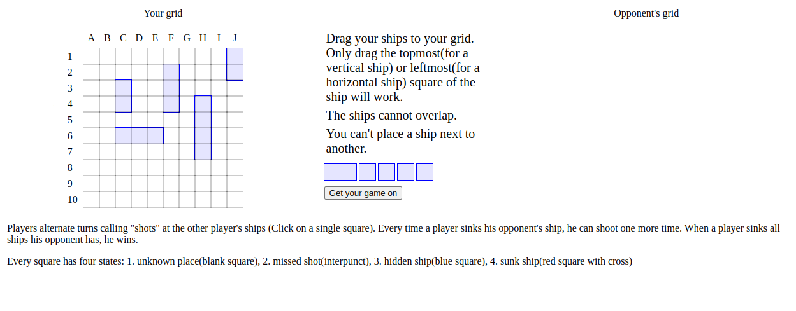
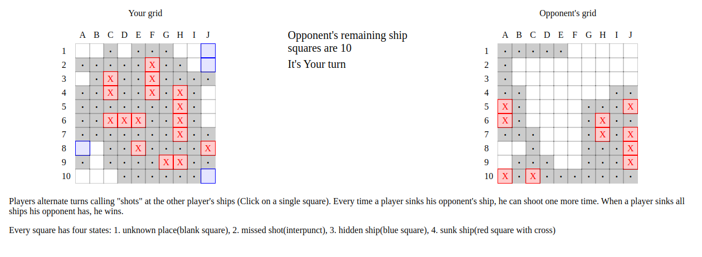

# 18.odin_battleship

[Task Description](https://www.theodinproject.com/lessons/node-path-javascript-battleship)

[Live Preview](https://maxim55069633.github.io/18.odin_battleship/)

In this lesson, I practice more javascript testing. I dabble in unit test, and test driven development but it turns out to be perplexing.

I learn:

1. Implement Drag and Drop API to user input.
2. JSON.tringify can be used to check the equality of objects.
3. Use outline to prevent double borders in css.
4. Empty an array quickly using `array.length = 0`.
5. Use structuredClone() to create a deep clone of a given value.

Sample:

1.  

2.  
